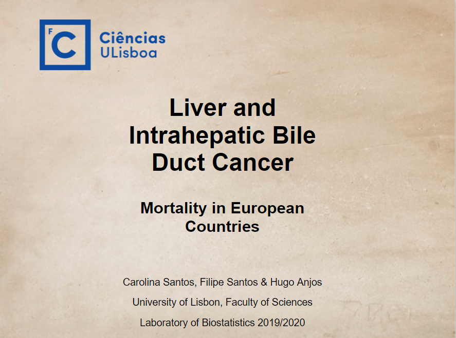

# `Assessment for Laboratory of Biostatistics`:
* Liver and Intrahepatic Bile Ducts Cancer in European Countries. 

## Objectives
* Explore cancer mortality geographical and time trends in the European Union
* Practicing the R skills learned throughout the semester 
* Practicing tidying datasets 
* Learning how to work with Git and GitHub

## The Data

We will be using two data sets, given to us by Professors Saghir Bashir and Marília Antunes, containing the data for 28 European Union Countries:

+ `CancerMortalityEU.csv`- number of deaths by cancer type, country, year, age group and sex

+ `PopulationEU.csv`- number of people by country, year, age group and sex 

## Questions
The countries we will be analysing are: `Austria`, `Cyprus`, `Germany`, `Portugal`, `Malta` and the `European Union`. For each question we will treat males and females separately.

+ What are the time trends in the mortality rates between countries for all age groups combines? How do they compare with the European Union overall?

+ Compare the mortality rates by age groups between countries for 2016.

+ Which country changed (increase or decreased) the most in percentage terms between 2011 and 2016?

+ What are the five most common cancer in 2011 and in 2017?

## Acknowledgements

We would like to thank Professors [Saghir Bashir](https://github.com/saghirb) and Marília Antunes for their availability to answer all our doubts and questions and for everything we learned from them this semester. 

A special thanks to everyone who shares their knowledge in coding online since it was very helpful for us to do some parts of this assessment, specially the presentation using the `xaringan` package. 

