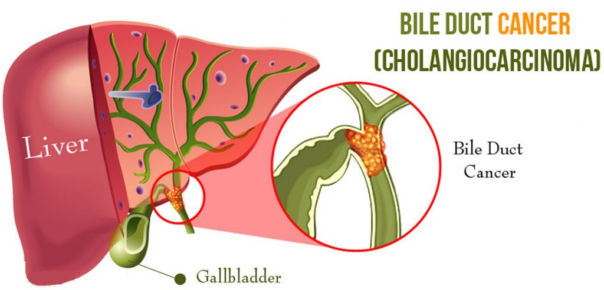

```{r setup, include=FALSE}
options(htmltools.dir.version = FALSE)
```

class: title-slide   


# Liver and Intrahepatic Bile Duct Cancer
## Mortality in European Countries 
### Carolina Santos, Filipe Santos & Hugo Anjos 
#### Universtity of Lisbon, Faculty of Sciences 

---
class: intro-slide

# Introduction 
## Selected Countries & Cancer Site

* Austria, Cyprus, Germany, Malta, Portugal and European Union



---
class: next3-slide
# Time trends in the mortality rates between countries for all age groups combined? 
# How do they compare with EU overall?


