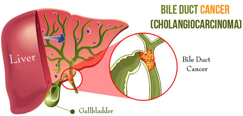

```{r setup, include=FALSE}
options(htmltools.dir.version = FALSE)
packages <- c("ggplot2", "here", "data.table", "unglue", "magrittr", "kableExtra", "dplyr", "xaringan")
if (length(setdiff(packages, rownames(installed.packages()))) > 0) {
  install.packages(setdiff(packages, rownames(installed.packages())))
}
library(here)
library(data.table)
library(unglue)
library(ggplot2)
library(magrittr)
library(kableExtra)
library(gganimate)
library(gifski)
library(png)
```

class: title-slide


# Liver and Intrahepatic Bile Ducts Cancer
## Mortality in European Countries 
### **Carolina Santos**, **Filipe Santos** & **Hugo Anjos** 
#### University of Lisbon, Faculty of Sciences
##### Laboratory of Biostatistics 2019/2020

---
class: intro-slide

# Introduction 

## Objective:

* Explore **Liver and Intrahepatic Bile Ducts Cancer mortality, geographical and time trends**

## Selected Countries:

* **Austria**, **Cyprus**, **Germany**, **Malta**, **Portugal** and **European Union**


.center[
 
]

### Image from: [medindia.net](https://www.medindia.net/patients/patientinfo/bile-duct-cancer.htm)

---
class: third-slide, center, middle

## Time trends in the mortality rates between countries for all age groups combined

```{r data, include=FALSE}
library(here)
library(data.table)
library(unglue)
library(ggplot2)
library(magrittr)
library(data.table)
library(dplyr)

data <- fread(here("CancerMortalityEU.csv"), header = TRUE, check.names = TRUE)
popdt <- fread("PopulationEU.csv", header = TRUE, check.names=TRUE)  


names(data)
cancro <- data[CancerSite %in% "Liver and Intrahepatic Bile Ducts"]
str(cancro)
cancro[, .N, by="CancerSite"] #Pode-se tirar esta coluna
cancro[, .N, by="Cause"] #Pode-se tirar esta coluna mas a ver se não se perde a informação
cancro[, .N, by="ageStart"] #Acho que se pode tirar também
cancro[, .N, by="ageLabel"] #Também acho que se pode tirar se bem que esta pode ser util à frente
cancro[, c("CancerSite", "Cause", "ageStart", "ageLabel"):=NULL]
setnames(cancro, "ageGroup", "Age")

cancer.new <- melt(cancro, id.vars = c("Country","Age"), variable.name = "all", value.name = "Deaths")
cancer.new[, `:=` (Year=as.numeric(gsub("[^[:digit:].]", "", all)))]
cancer.new[, Sex:=as.character(unglue_vec(all,"{x}_{y}",var="x"))]
cancer.new[, .N, by="Year"]
cancer.new[, .N, by="Sex"]
cancer.new[, all:=NULL]
setcolorder(cancer.new, c("Country","Age","Sex","Year","Deaths"))
cancer.new <- na.omit(cancer.new)

cancer.EU <- cancer.new[, .(Country = "European Union", Deaths = sum(Deaths, na.rm = TRUE)), by = .(Year, Sex, Age)]
setcolorder(cancer.EU, c("Country","Age","Sex","Year","Deaths"))
cancer.liver <- rbind(cancer.new,cancer.EU)


allAge <- cancer.liver[, .(Age = "All", Deaths = sum(Deaths, na.rm = TRUE)), by = .(Country, Year, Sex)]
setcolorder(allAge, c("Country", "Sex", "Age", "Year", "Deaths"))
cancer.liver <- rbind(cancer.liver,allAge)
cancer.liver <- cancer.liver[Country %in% c("Austria", "Cyprus", "Germany", "Malta", "Portugal", "European Union")][order(Year, Country, Sex)]
cancer.liver

popdt <- fread("PopulationEU.csv", header = TRUE, check.names=TRUE)

popdt[, c("ageStart","ageLabel","X2000","X2001","X2002","X2003","X2004","X2005","X2006","X2007","X2008","X2009","X2010","X2018"):=NULL]
setnames(popdt, c("ageGroup"), c("Age"))

popT <- melt(popdt,
             id.vars = c("Country", "Sex", "Age"),
             measure = patterns("^X"),
             variable.name = "YearX",
             value.name = c("Population"),
             na.rm = TRUE)

popT[, `:=` (Year=as.numeric(gsub("[^[:digit:].]",
                                  "", YearX)))][, YearX := NULL]
setcolorder(popT, c("Country", "Sex", "Age", "Year", "Population"))
popT <- popT[Sex != "Total"]

popEU <- popT[, .(Population = sum(Population, na.rm = TRUE)), by = .(Year, Sex, Age)][, Country := "European Union"]
setcolorder(popEU, c("Country", "Sex", "Age", "Year", "Population"))
pop <- rbind(popT, popEU)
pop <- pop[order(Year, Country)]

allAge <- pop[, .(Age = "All", Population = sum(Population, na.rm = TRUE)), by = .(Country, Year, Sex)]
setcolorder(allAge, c("Country", "Sex", "Age", "Year", "Population"))
allAge <- allAge[order(Year, Country)]

pop <- rbind(pop, allAge)
pop <- pop[order(Year, Country, Sex)]
popF <- pop[Country %in% c("Austria", "Cyprus", "Germany", "Malta", "Portugal", "European Union")]
popF <- popF[order(Year, Country)]
popF

data.f <- cancer.liver[popF, on=c("Country","Age","Sex","Year")]
data.f[, mrate := round(100000*Deaths/Population,2)]
data.f[Age %in% "All"][Sex %in% "Females"][, sum(Deaths, na.rm = TRUE), by=Country]
data.f
```

```{r q1 females&males, echo=FALSE, fig.align="center", fig.width=11, fig.height=6, warning=FALSE}
data.f[Age %in% "All"] %>% 
  ggplot(aes(Year,mrate, group=Country, colour = Country)) +
  geom_point(size=3) +
  geom_line(size=1.3) +
  ylab("Mortality Rate") +
  scale_x_continuous(labels=data.f[,Year], breaks = data.f[,Year])+
  theme_dark() +
  theme(plot.title = element_text(size=24, face = "bold", hjust = 0.5), 
        legend.position = "bottom",
        axis.title = element_text(size = 20),
        axis.text = element_text(size =14),
        legend.text = element_text(size=12),
        legend.title = element_text(size = 14),
        axis.text.x = element_text(angle=45, vjust = 0.5))+
  scale_colour_manual(labels = c("Austria", "Cyprus", "European Union", "Germany", "Malta", "Portugal"), values = c("#F8766D", "#B79F00", "#00BA38", "yellow", "#619CFF", "#F564E3"))+
  theme(strip.text = element_text(size = 18))+
  facet_wrap(~Sex)+
  scale_y_continuous(sec.axis = dup_axis(breaks = c(5,10,15)))
```

Overall **increasing trend** for every country & values for **mortality for males** are **higher than** those of **females**

---
class: fourth-slide, center, middle

## Mortality rates by age groups between countries in 2016

```{r data.ex2, include=FALSE}
data.2016 <- data.f[Year %in% "2016"][Deaths != "NA"]
data.2016$Age <- as.factor(data.2016$Age)
levels(data.2016$Age)
data.2016$Age <- factor(data.2016$Age, levels(data.2016$Age)[c(1,10,2:9,11:19)])
```

```{r q2 females, echo=FALSE, fig.align="center", fig.width=11, fig.height=6, warning=FALSE}
data.2016[Sex %in% "Females"][Age != "All"] %>%
ggplot(aes(Age,mrate, group=Country, colour=Country))+
    geom_point(size=3)+
    geom_line(size=1.3)+
    ggtitle("Female population")+
    ylab("Mortality Rate")+
    theme_dark()+
    theme(plot.title = element_text(size=22, face = "bold", hjust = 0.5), 
          legend.position = "bottom",
          axis.title = element_text(size = 20),
          axis.text = element_text(size =14),
          legend.text = element_text(size=12),
          legend.title = element_text(size = 14), 
          axis.text.x = element_text(angle=45, vjust = 0.5))+
    scale_colour_manual(labels = c("Austria", "Cyprus", "European Union", "Germany", "Malta", "Portugal"), values = c("#F8766D", "#B79F00", "#00BA38", "yellow", "#619CFF", "#F564E3"))
```

The **first age groups** show very **low mortality** rate & **older population** is **more susceptible** to die due to this kind of cancer 

---
class: fifth-slide, center, middle
## Mortality rates by age groups between countries in 2016

```{r q2 males, echo=FALSE, fig.align="center", fig.width=11, fig.height=6, warning=FALSE}
data.2016[Sex %in% "Males"][Age != "All"] %>%
  ggplot(aes(Age,mrate, group=Country, colour=Country))+
  geom_point(size=3)+
  geom_line(size=1.3)+
  theme(axis.text.x = element_text(angle=45, vjust = 0.5))+
  ggtitle("Male population")+
  ylab("Mortality Rate") +
  theme_dark()+
  theme(plot.title = element_text(size=22, face = "bold", hjust = 0.5), 
        legend.position = "bottom",
        axis.title = element_text(size = 20),
        axis.text = element_text(size =14),
        legend.text = element_text(size=12),
        legend.title = element_text(size = 14), 
        axis.text.x = element_text(angle=45, vjust = 0.5))+
  scale_colour_manual(labels = c("Austria", "Cyprus", "European Union", "Germany", "Malta", "Portugal"), values = c("#F8766D", "#B79F00", "#00BA38", "yellow", "#619CFF", "#F564E3"))
```

Mortality rate is **higher for the Male population** & **older population** is **more susceptible** to die due to this kind of cancer

---
class: sixth-slide, middle

.center[
## Changes in percentage terms between 2011 and 2016
] 

```{r data.ex3, echo=FALSE, fig.align="center", message=FALSE, warning=FALSE}
# For the male population
data.diff.M <- data.f[Year != 2017][Year != 2011 & Sex %in% "Males" & Age %in% "All"]
data.diff.M[,per := ((data.diff.M$mrate - data.f[Year %in% 2011 & Sex %in% "Males" & Age %in% "All"]$mrate )/data.f[Year %in% 2011 & Sex %in% "Males" & Age %in% "All"]$mrate*100)]
diff.M <- data.diff.M[, DiffCountry := sprintf("%3.1f%%", per)][Year %in% "2016"][, .(Country, Sex, DiffCountry)]
diff.Males <- dcast(diff.M, Country ~ Sex, value.var = "DiffCountry" )

# For the female population
data.diff.F <- data.f[Year != 2017][Year != 2011 & Sex %in% "Females" & Age %in% "All"]
data.diff.F[,per := ((data.diff.F$mrate - data.f[Year %in% 2011 & Sex %in% "Females" & Age %in% "All"]$mrate )/data.f[Year %in% 2011 & Sex %in% "Females" & Age %in% "All"]$mrate*100)]
diff.F <- data.diff.F[, DiffCountry := sprintf("%3.1f%%", per)][Year %in% "2016"][, .(Country, Sex, DiffCountry)]
diff.Females <- dcast(diff.F, Country ~ Sex, value.var = "DiffCountry" )
```


```{r , echo=FALSE, fig.align="center", message=FALSE, warning=FALSE}
library(kableExtra)
all <- cbind(diff.Females,diff.Males$Males)
setnames(all, "V2", "Males")
all %>%
  kable(align = "ccc") %>%
  kable_styling(bootstrap_options = "striped") %>%
  row_spec(c(0,2,4,6), background = "Linen") %>%
  row_spec(c(1,3,5), background = "white") %>%
  row_spec(c(2,5), italic = T)
```

                        
* *Female Population*: the country that changed the most was **Cyprus** with an **increase of 29.9%**

* *Male Population*: the country that changed the most was **Malta** with an **increase of 71.5%**

---
class: seventh-slide, center, middle

## Changes in percentage terms between 2011 and 2016 

```{r ex3, echo=FALSE, fig.align="center", fig.width=11, fig.height=6, warning=FALSE}
data.all <- rbind(data.diff.F, data.diff.M)
data.all %>%
  ggplot(aes(Year, per, group=Country, colour =Country))+
  geom_point(size=3)+
  geom_line(size=1.3)+
    ylab("Difference in %")+
    scale_colour_manual(labels = c("Austria", "Cyprus", "European Union", "Germany", "Malta", "Portugal"), values = c("#F8766D", "#B79F00", "#00BA38", "yellow", "#619CFF", "#F564E3"))+
   theme_dark()+
   theme(plot.title = element_text(size=22, face = "bold", hjust = 0.5), 
        legend.position = "bottom",
        axis.title = element_text(size = 20),
        axis.text = element_text(size =14),
        legend.text = element_text(size=12),
        legend.title = element_text(size = 14), 
        axis.text.x = element_text(angle=45, vjust = 0.5))+
    theme(strip.text = element_text(size = 18))+
    facet_wrap(~Sex)+
    theme(strip.text = element_text(size = 18))+
    scale_y_continuous(sec.axis = dup_axis(breaks = c(-25,0,25,50,75)))
```

* Even though Cyprus and Malta show the biggest increase between 2011 and 2016, that's not the case for the other years
---
class: eighth-slide, middle

.center[
## Most common cancers for Females in 2011 and 2016
]

```{r data.ex4, include=FALSE}
library(kableExtra)
# Reading all cancer data
allCancer <- fread("CancerMortalityEU.csv",
               header = TRUE, check.names=TRUE)

# Removing superfluous columns
allCancer[, c("Cause", "ageStart", "ageLabel"):=NULL]
setnames(allCancer, "ageGroup", "Age")

# Converting table to long format
allCancer <- melt(allCancer,
                  id.vars = c("Country","Age","CancerSite"),
                  variable.name = "Sex+Year",
                  value.name = "Deaths")

# Separating Year and Sex data
allCancer[, `:=` (Year=as.numeric(gsub("[^[:digit:].]",
                            "", `Sex+Year`)))]
allCancer[, Sex:=as.character(unglue_vec(`Sex+Year`,"{x}_{y}",var="x"))]
allCancer[, "Sex+Year":=NULL]
setcolorder(allCancer, c("Country","Year","Sex","Age","CancerSite","Deaths"))

# Creating EU as a country
cancerEU <- allCancer[, .(Country = "European Union", Deaths = sum(Deaths)), by = .(Year, Sex, Age, CancerSite)]
setcolorder(cancerEU, c("Country","Year","Sex","Age","CancerSite","Deaths"))
allCancer <- rbind(allCancer, cancerEU)

# Creating All ages rows
allAge <- allCancer[, .(Age = "All", Deaths = sum(Deaths, na.rm = TRUE)), by = .(Country, Year, Sex, CancerSite)]
setcolorder(allAge, c("Country","Year","Sex","Age","CancerSite","Deaths"))
allCancer <- rbind(allCancer, allAge)

# Selecting the important countries
allCancer <- allCancer[Country %in% c("Austria", "Cyprus", "Germany", "Malta", "Portugal", "European Union")
                             ][order(Year, Country)]

# Removing "All Cancer" from CancerSite
allCancer <- allCancer[CancerSite != "All Cancers"]

allCancer
```

```{r q4 females2011, include=FALSE, fig.align="center"}
library(kableExtra)
cancersF <- allCancer[Sex=="Females"][Year=="2011"][Age=="All"][order(CancerSite)]
cancersF <- cancersF[, .(Deaths = sum(Deaths, na.rm = TRUE)), by = .(CancerSite)]
cancersF11 <- cancersF[order(-Deaths), head(.SD,5)] 
kable(cancersF11, align = "lc")%>% 
  kable_styling(bootstrap_options = c("hover", "striped"), full_width = F)
```

```{r q4 females2016, include=FALSE, fig.align="center"}
library(kableExtra)
cancersF <- allCancer[Sex=="Females"][Year=="2016"][Age=="All"][order(CancerSite)]
cancersF <- cancersF[, .(Deaths = sum(Deaths, na.rm = TRUE)), by = .(CancerSite)]
cancersF16 <- cancersF[order(-Deaths), head(.SD,5)]
kable(cancersF16, align = "lc")%>% 
  kable_styling(bootstrap_options = c("hover", "striped"), full_width = F)
```

```{r fData, echo= FALSE}
allCF <- cbind(cancersF11, cancersF16)
allCF <- allCF[,c(1,2,4,3)]
knitr::kable(allCF, format = "html", align="cccc") %>%
  kable_styling(bootstrap_options = "striped") %>%
  row_spec(0, background="Linen") %>%
  row_spec(c(1,3,5), background = "white") %>%
  row_spec(c(2,4), background = "Linen") %>%
  add_header_above(c("2011" = 2, "2016" = 2), background="white")
```


 * **Same cancers** as the top 5 for both years
 
 * **Increases:** Breast, Trachea/Bronchus/Lung and Pancreas
 
 * **Decreases:** Colon and Ovary
 
---
class: ninth-slide, middle

.center[
## Most common cancers for Males in 2011 and 2016
]

```{r q4 males2011, include=FALSE, fig.align="center"}
library(kableExtra)
cancersM <- allCancer[Sex=="Males"][Year=="2011"][Age=="All"][order(CancerSite)]
cancersM <- cancersM[, .(Deaths = sum(Deaths, na.rm = TRUE)), by = .(CancerSite)]
cancersM11 <- cancersM[order(-Deaths), head(.SD,5)]
kable(cancersM11, align = "rc")%>% 
  kable_styling(bootstrap_options = "striped")
```

```{r q4 males2016, include=FALSE, fig.align="center"}
library(kableExtra)
cancersM <- allCancer[Sex=="Males"][Year=="2016"][Age=="All"][order(CancerSite)]
cancersM <- cancersM[, .(Deaths = sum(Deaths, na.rm = TRUE)), by = .(CancerSite)]
cancersM16 <- cancersM[order(-Deaths), head(.SD,5)]
kable(cancersM16, align = "rc")%>% 
  kable_styling(bootstrap_options = "striped")
```


```{r mData, echo= FALSE}
allCM <- cbind(cancersM11, cancersM16)
allCM <- allCM[,c(1,2,4,3)]
knitr::kable(allCM, format = "html", align="cccc") %>%
  kable_styling(bootstrap_options = "striped") %>%
  row_spec(0, background="Linen") %>%
  row_spec(c(1,3,5), background = "white") %>%
  row_spec(c(1,5), italic=T) %>%
  row_spec(c(2,4), background = "Linen") %>%
  add_header_above(c("2011" = 2, "2016" = 2), background="white")
```


 * Only change is **Liver over Stomach**
 
 * **Trachea/Bronchus/Lungs** is the **deadliest** by a large margin
 
 * Most **cancers increase** in number of deaths
 
---
class: conclusion-slide, middle

.center[
## Conclusions
]

* Data shows an overall **slight increase in the mortality rate** for Liver and Intrahepatic Bile Ducts cancer (2011 to 2016).
 
* Data also shows that this cancer is **more aggressive to older people**, showing higher mortality rates
 
* **Most common cancers** are (almost) the **same** from 2011 to 2016.
 
* **Lack of data for 2017** makes this analysis more difficult & given the data limitations, the **true mortality rate might be higher**

```{r ggA2, echo=FALSE,  fig.align="center", fig.width=6, fig.height=4, warning=FALSE}
data.f$Sex <- as.factor(data.f$Sex)
f <- data.f[mrate != "NA"][Age %in% "All"] %>%
  ggplot(aes(Year, mrate, colour= Country, group = Country ))+
  geom_line(size=1.3) +
  theme(legend.position = "bottom")+
  theme_dark() +
  theme(plot.title = element_text(size=24, face = "bold", hjust = 0.5), 
        legend.position = "bottom",
        axis.title = element_text(size = 20),
        axis.text = element_text(size =14),
        legend.text = element_text(size=12),
        legend.title = element_text(size = 14),
        axis.text.x = element_text(angle=45, vjust = 0.5))+
  scale_colour_manual(labels = c("Austria", "Cyprus", "European Union", "Germany", "Malta", "Portugal"), values = c("#F8766D", "#B79F00", "#00BA38", "yellow", "#619CFF", "#F564E3"))+
  theme(strip.text = element_text(size = 18))

f+transition_reveal(Year)+
  facet_wrap(~Sex)
```